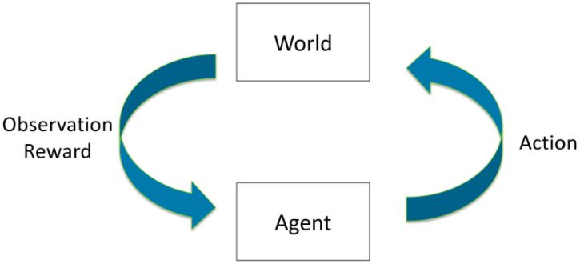

# Stanfrod cs234 Reinforcement Learning

     

## Course Description
To realize the dreams and impact of AI requires autonomous systems that learn to make good decisions. Reinforcement learning is one powerful paradigm for doing so, and it is relevant to an enormous range of tasks, including robotics, game playing, consumer modeling and healthcare. This class will provide a solid introduction to the field of reinforcement learning and students will learn about the core challenges and approaches, including generalization and exploration.

## Assignments
### Assignment 1
Implement value and policy iteration algorithm to train a toy RL agent.

### Assignment 2
Implement DQN (Deep Q-Network) to train RL agent to play Pong, according to [this paper](https://www.nature.com/articles/nature14236).

### Assignment 3
Set up policy gradient for both continuous and discrete OpenAI Gym environments and implement a NN baseline for variance reduction.

## Notes
Notes that I've organized throughout the course can be found [here](https://github.com/martinzwm/stanford-cs234/tree/master/notes).